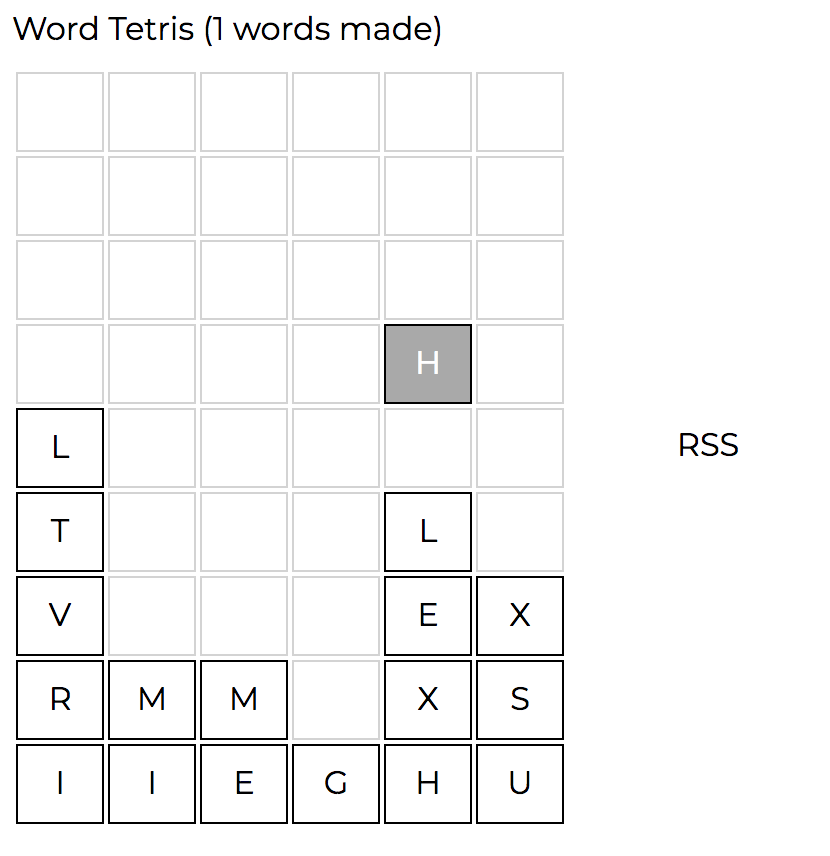

# Word Tetris 

Tetris with words. Instead of removing blocks by forming lines, remove blocks by forming words.

Play it [here](https://sgoedecke.github.io/word-tetris/index.html).

## Todo

* Better word list: more words, more common words
* Preview letters or spawn letters weighted towards common letters
* Look for longer words first so 'VEND' doesn't score as 'END'
* Find a way to respect empty blocks when forming words
* More efficient rendering algorithm. Two passes, not as many passes as letters
* Animate explosions and maybe falling blocks
